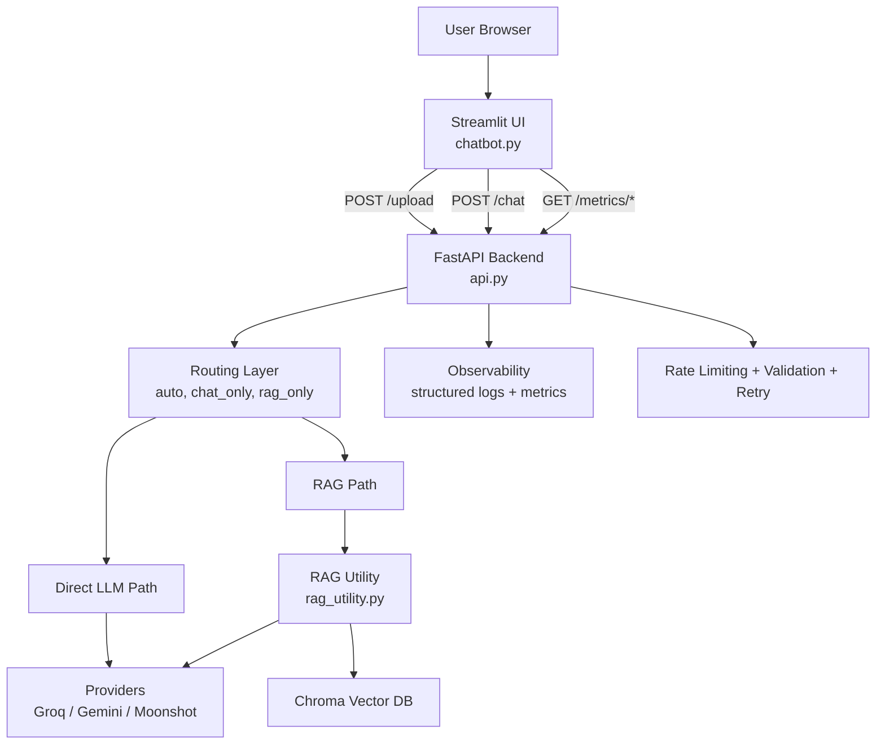
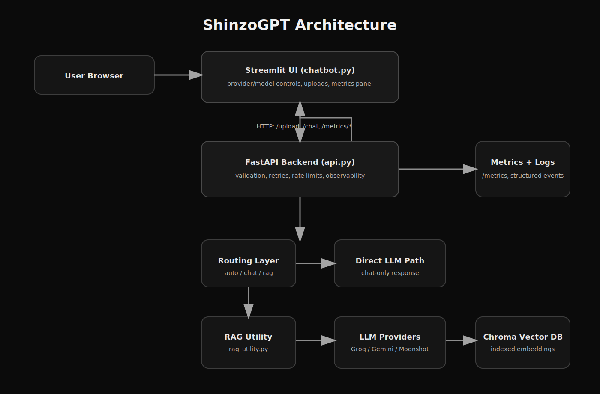

# ShinzoGPT

[](https://github.com/shinzoxD/streamlit-genai-chatbot/actions/workflows/ci-tests.yml)
[](https://github.com/shinzoxD/streamlit-genai-chatbot/actions/workflows/deploy-to-hf-space.yml)
[](https://huggingface.co/spaces/shinzobolte/ShinzoGPT)

ShinzoGPT is a document-aware AI chat app with:
- Streamlit frontend (`chatbot.py`)
- FastAPI backend (`api.py`)
- Chroma vector store + LangChain RAG (`rag_utility.py`)
- Docker + Hugging Face Spaces deployment
- GitHub Actions auto-deploy to Hugging Face Space

Live links:
- App: https://huggingface.co/spaces/shinzobolte/ShinzoGPT
- GitHub Actions: https://github.com/shinzoxD/streamlit-genai-chatbot/actions

## Architecture Diagram



Static architecture image (for platforms without Mermaid support):



## Quantitative Results (Measured)

Measured at `2026-02-26T22:26:10Z` using:
- Retrieval benchmark: `evaluation/benchmark.jsonl` on `vector_db_1771979965`
- Runtime benchmark: 5 real `/chat` requests per model in `chat_only` mode
- Model matrix tested: all models currently exposed by this app configuration

| Provider | Model | Status | Hit@3 | MRR@3 | Faithfulness | p95 Latency (ms) | Error Rate |
|---|---|---|---:|---:|---:|---:|---:|
| Groq | llama-3.3-70b-versatile | ok | 1.00 | 1.00 | 1.00 | 1415.75 | 0.00% |
| Groq | llama-3.1-8b-instant | ok | 1.00 | 1.00 | 0.80 | 757.60 | 0.00% |
| Gemini | gemini-2.0-flash | failed | - | - | - | - | - |
| Gemini | gemini-1.5-flash | failed | - | - | - | - | - |
| Moonshot Kimi | moonshotai/kimi-k2.5 | ok | 1.00 | 1.00 | 0.96 | 132852.83 | 0.00% |
| Moonshot Kimi | moonshotai/kimi-k2-thinking | ok | 1.00 | 1.00 | 0.97 | 17672.65 | 0.00% |

Recommended default for demo/recruiter walkthrough: **Groq `llama-3.3-70b-versatile`** (best quality-speed balance in this run).

Gemini failure reasons during this run:
- `gemini-2.0-flash`: `429 RESOURCE_EXHAUSTED` (quota exceeded / billing plan limits).
- `gemini-1.5-flash`: `404 NOT_FOUND` for the configured API version/model access.

Reproducible reports:
- [Model matrix report](./evaluation/model_matrix_latest.json)
- [Full eval report (single-model baseline)](./evaluation/report_latest_full.json)
- [Retrieval-only report (single-model baseline)](./evaluation/report_latest_retrieval.json)
- [Runtime benchmark report (single-model baseline)](./evaluation/runtime_benchmark_latest.json)

## Flagship-Readiness Features

### 1) Evaluation Metrics
- Retrieval metrics: hit rate, MRR, precision@k
- Answer grounding proxy: faithfulness score from response/context overlap
- Keyword recall against benchmark expectations

Run evaluation:

```bash
python evaluation/evaluate_rag.py ^
  --vector-db-path vector_db_1234567890 ^
  --benchmark-file evaluation/benchmark.jsonl ^
  --top-k 3 ^
  --provider Groq ^
  --model llama-3.3-70b-versatile ^
  --api-key <YOUR_API_KEY> ^
  --out-file evaluation/report.json
```

You can also run retrieval-only eval (omit provider/model/api-key).

Run full model-matrix benchmark (all configured UI models):

```bash
python evaluation/benchmark_model_matrix.py
```

This writes `evaluation/model_matrix_latest.json` with per-model metrics and failure reasons.

### 2) Testing + Reliability
- Unit/integration tests in `tests/`
- LLM invocation retry with exponential backoff
- HTTP retry + timeout strategy in Streamlit client
- Stronger backend error handling and safer responses

Run tests:

```bash
pytest -q
```

### 3) Observability
- Structured JSON logs (`request_completed`, `chat_completed`, etc.)
- Request-level latency/error telemetry
- Estimated token/cost tracking (configurable)
- Metrics endpoints:
  - `GET /metrics/summary`
  - `GET /metrics/events?limit=50`
- Streamlit includes a runtime metrics panel

Optional protection:
- Set `OBSERVABILITY_TOKEN` and call metrics endpoints with `x-observability-token` header.

### 4) Security Basics
- Query length limits (`MAX_QUERY_CHARS`)
- Upload limits (`MAX_UPLOAD_FILES`, `MAX_UPLOAD_FILE_MB`)
- File type and empty-file checks
- Rate limiting per IP for `/chat` and `/upload`
- Safer vector DB path validation
- API keys never logged

## Environment Variables

See `env_template.txt` for all settings.

Core keys:
- `GROQ_API_KEY`
- `GOOGLE_API_KEY`
- `MOONSHOT_API_KEY`

Operational controls:
- `CHAT_RATE_LIMIT_PER_MIN`
- `UPLOAD_RATE_LIMIT_PER_MIN`
- `LLM_RETRY_ATTEMPTS`
- `HTTP_CONNECT_TIMEOUT_SEC`
- `HTTP_READ_TIMEOUT_CHAT_SEC`
- `HTTP_READ_TIMEOUT_UPLOAD_SEC`

Cost estimation (optional):
- `DEFAULT_INPUT_COST_PER_1K_TOKENS`
- `DEFAULT_OUTPUT_COST_PER_1K_TOKENS`
- `MODEL_PRICING_OVERRIDES_JSON`

## Deploy (GitHub -> Hugging Face)

Workflow: `.github/workflows/deploy-to-hf-space.yml`

On each push to `main`/`master`:
1. Validates required secrets
2. Pushes exact GitHub commit to HF Space `main`

Required GitHub repository secrets:
- `HF_TOKEN`: Hugging Face token with write access to the Space repo
- `HF_SPACE_ID`: `username/space-name`

## Failures + Tradeoffs

### Known Failure Modes
- Retrieval can return the right source file but still miss a specific detail chunk.
- In-memory rate limiting resets on restart and is not shared across replicas.
- Faithfulness score is heuristic and can overestimate factual grounding.
- Provider/network timeouts can still happen under external API instability.

### Mitigations
- Use top-k retrieval + source display + route controls (`chat_only` / `rag_only`) for debugging.
- Add retries with exponential backoff for model calls and HTTP client requests.
- Enforce strict input/file limits and payload validation to reduce bad requests.
- Expose runtime metrics and structured logs to detect latency/error regressions quickly.

### Tradeoffs
- Simple observability and rate limiting keep deployment lightweight but are less robust than distributed stacks.
- Cost telemetry is estimate-based unless provider-side token usage metadata is available.
- Current benchmark is small and domain-focused; broader generalization needs a larger test set.
